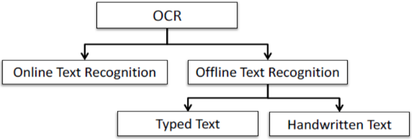
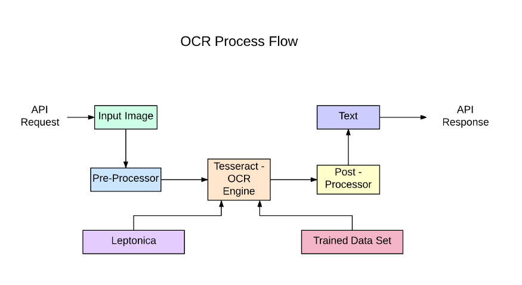
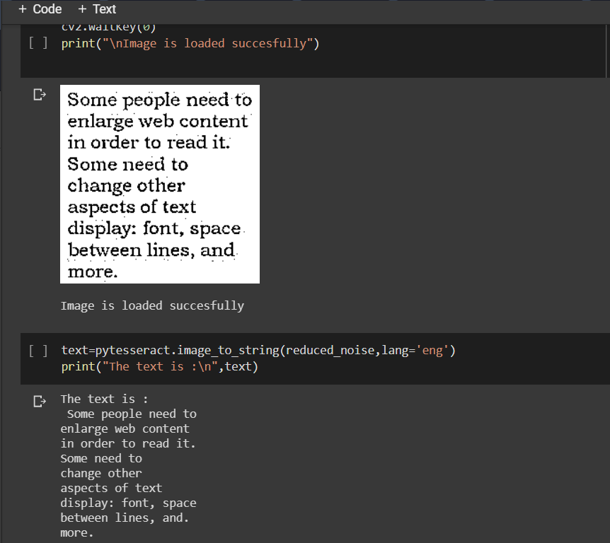
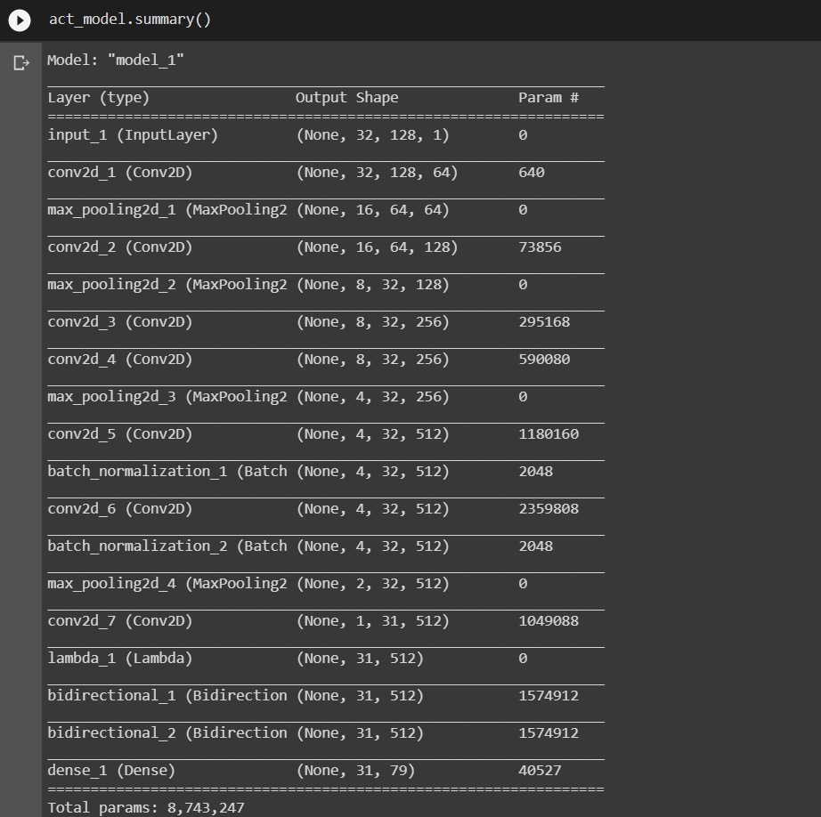
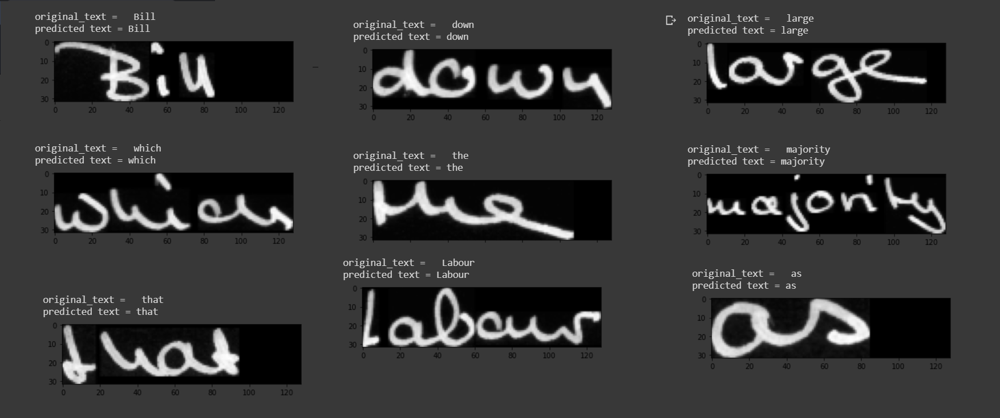

# Handwritten-Text-Recognition-Tesseract-OCR
OCR systems have two categories: online, in which input information is obtained through real-time writing sensors; and offline, in which input information is obtained through static information (images).

## For offline typed text we use PyTesseract.
Python-tesseract is an optical character recognition (OCR) tool for python. That is, it will recognize and “read” the text embedded in images.

Python-tesseract is a wrapper for Google’s Tesseract-OCR Engine. It is also useful as a stand-alone invocation script to tesseract, as it can read all image types supported by the Pillow and Leptonica imaging libraries, including jpeg, png, gif, bmp, tiff, and others. Additionally, if used as a script, Python-tesseract will print the recognized text instead of writing it to a file.

## Output

## For offline handwrritten text we use CRNN model.

### Dataset used: **[IAM Dataset](http://www.fki.inf.unibe.ch/databases/iam-handwriting-database/download-the-iam-handwriting-database)**
>For downloading this dataset you need to create an account.

Dataset used to here to train model **[words.tgz](http://www.fki.inf.unibe.ch/DBs/iamDB/data/words/)**

 

### Model Overview.
<b>Model = CNN + RNN + CTC loss</b>

Model consists of <b>three</b> parts:

* The convolutional neural network to extract features from the image.

* Recurrent neural network to predict sequential output per time-step.

* CTC loss function which is transcription layer used to predict output for each time step. 
 

### Model Architecture.

>This network architecture is inspired by **[this](https://arxiv.org/pdf/1507.05717.pdf)** paper. 

#### Steps used to create the architecture:
* Input shape for our architecture having an input image of height 32 and width 128.
* Here we used seven convolution layers of which 6 are having kernel size (3,3) and the last one is of size (2.2). And the number of filters is increased from 64 to 512 layer by layer.
* Two max-pooling layers are added with size (2,2) and then two max-pooling layers of size (2,1) are added to extract features with a larger width to predict long texts.
* Also, we used batch normalization layers after fifth and sixth convolution layers which accelerates the training process.
* Then we used a lambda function to squeeze the output from conv layer and make it compatible with LSTM layer.
* Then used two Bidirectional LSTM layers. This RNN layer gives the output of size (batch_size, 31, 79),here 79 is the total number of output classes including blank character.

#### Loss Function.
CTC loss is very helpful in text recognition problems. It helps us to prevent annotating each time step and help us to get rid of the problem where a single character can span multiple time step which needs further processing if we do not use CTC.

A CTC loss function requires four arguments to compute the loss, predicted outputs, ground truth labels, input sequence length to LSTM and ground truth label length. To get this we need to create a custom loss function and then pass it to the model. 

## Output

### Improving the model.

If you want to improve the recognition accuracy, follow these:
* Data augmentation: increase dataset-size by applying further (random) transformations to the input images
* Remove cursive writing style in the input images (**[DeslantImg](https://github.com/githubharald/DeslantImg)**)
* Increase input size (if input of NN is large enough, complete text-lines can be used)
* Add more CNN layers
* Decoder: use token passing or word beam search decoding (**[CTCWordBeamSearch](https://github.com/githubharald/CTCWordBeamSearch)**) to constrain the output to dictionary words
* Text correction: if the recognized word is not contained in a dictionary, search for the most similar one
